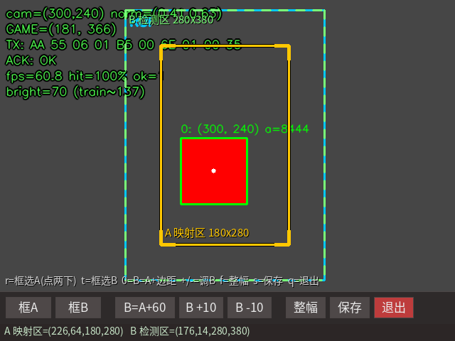
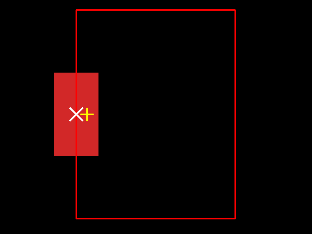
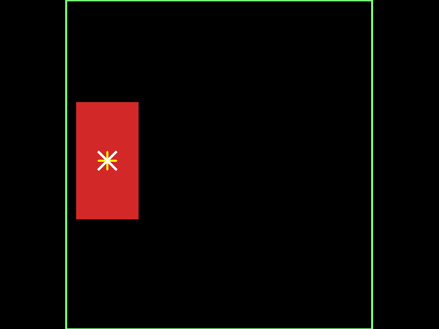
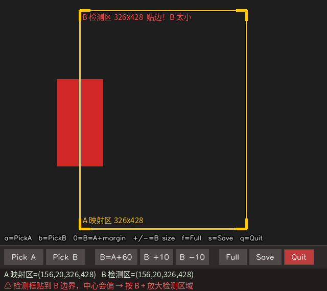

# SmartClock 视觉端 · 关键原理讲解（教学版）

本文面向"想真正搞懂这套系统怎么工作"的读者。它不追求面面俱到，而是把
**六个关键原理**从零讲清楚：每一步先说"要解决什么问题"，再说"怎么做"，
然后给公式、给数字、给可以自己动手验证的命令。

读完本文你应该能够回答：

- 一张 640×480 的照片，是怎么变成 STM32 屏幕上一个挡板位置的？
- 为什么"检测区域"和"映射区域"必须是两个框，而不是一个？
- 为什么在画面边缘，卡片中心会算错？错多少？怎么量化？
- 10 个字节里每个字节是什么意思？CRC 是怎么算出来的？
- 板子上装不了官方的 NPU Python 库，那怎么调 NPU？

---

## 第一章 全局：一帧图像的六步旅程

先把整条链路串起来，后面各章再逐个拆开。

```
  USB 摄像头（640×480，16.7 fps）
        │  图像
        ▼
  ① YOLO26 / RKNN 检测红卡
        │  检测框
        ▼
  ② 双 ROI 映射成游戏坐标
        │  (x, y)
        ▼
  ③ 组 10 字节帧 + CRC-8
        │  串口 115200
        ▼
  STM32 → 驱动挡板跟随卡片
```

**一句话概括**：摄像头给出"卡片在画面里的哪个像素"，系统要把它翻译成
"挡板应该在游戏里的哪个位置"，并且保证翻译得**准**、**稳**、**不丢**。

| 步骤 | 输入 | 输出 | 关键点 |
|---|---|---|---|
| ① 采集 | 光线 | 640×480 BGR 图像 | 帧率、曝光、白平衡 |
| ② 检测 | 图像 | 卡片检测框 + 置信度 | 模型、letterbox、NMS |
| ③ 裁剪 | 检测区域 B | 送模型的子图 | **为边缘精度服务**（第三章） |
| ④ 映射 | 框中心像素坐标 | 游戏坐标 (35..389, 6..578) | 线性拉伸 + 平滑 + 死区 |
| ⑤ 组帧 | 两个坐标 | 10 字节 | 小端、CRC-8 |
| ⑥ 下发 | 字节 | 挡板移动 | 应答 OK / ERROR |



---

## 第二章 检测原理：从图像到"卡片在哪"

### 2.1 为什么是 YOLO，而不是颜色阈值

最朴素的做法是"找红色的像素，求质心"。它在实验室能跑，但现场会遇到：

- 卡面反光 → 白色高光区域 HSV 里不再是红色
- 手在卡片上方投下阴影 → 同一张卡出现两种颜色
- 摄像头自动白平衡漂移 → 昨天调好的阈值今天失效
- 背景里有同色物体 → 直接误检

学习类方法（YOLO）学的是**形状 + 纹理 + 颜色**的联合特征，对上述变化
鲁棒得多。本项目实测：测试集精确率 100%、召回率 96.97%。

> 但 HSV 并没有被丢掉——它是**降级引擎**。如果模型文件损坏或 NPU 不可用，
> 改一行配置（`detector.engine: hsv`）系统仍能跑，方便现场判断
> "到底是模型的问题还是系统的问题"。

### 2.2 letterbox：一个容易被忽略的细节

模型输入固定 **640×640**，而摄像头是 **640×480**（4:3）。
如果直接 `resize` 到正方形，物体在纵向会被压缩 25%：

```
  原图 640×480            模型输入 640×640
  ┌─────────┐            ┌───────────┐
  │    ⭕   │  ────────▶ │░░░░░░░░░░░│ ← 灰边
  │         │            │  ┌─────┐  │
  └─────────┘            │  │  ⭕ │  │
                         │  └─────┘  │
  直接拉伸会压扁物体       │░░░░░░░░░░░│ ← 灰边
  等比缩放 + 填灰边则不会   └───────────┘
```

计算过程（以 640×480 → 640×640 为例）：

```
scale = min(640/640, 640/480) = 1.0       取较小的缩放比
新尺寸 = 640 × 480
pad_x = (640 − 640) / 2 = 0
pad_y = (640 − 480) / 2 = 80               上下各填 80 像素灰边
```

**反变换**（把模型输出的框还原到原图）必须减掉填充量：

```
原图坐标 = (模型坐标 − pad) / scale
```

忘记减 `pad` 是新手最常见的错误，表现为"检测框整体偏移半个填充量"。

### 2.3 输出张量的形状与含义

本项目的模型输出：

```
[1, 5, 8400]
 │  │   └── 8400 个候选框
 │  └────── 每个框 5 个数：cx, cy, w, h, conf
 └───────── batch = 1
```

注意 **是 `cxcywh`（中心点 + 宽高），不是 `xyxy`（对角点）**。转换公式：

```
x1 = cx − w/2        x2 = cx + w/2
y1 = cy − h/2        y2 = cy + h/2
```

> **真实踩坑记录**：早期文档把输出写成 `xyxy`，按 `xyxy` 解析会让检测框
> 严重错位，而且**程序不报错**（数字都是合法的，只是含义错了）。
> 判别方法：`cxcywh` 的中心点必然落在 `[0,1]` 且宽高为正；
> 若把 `cx,cy` 当成 `x1,y1`、`w,h` 当成 `x2,y2`，会算出大量负的宽高。

### 2.4 NMS：同一个卡片只留一个框

同一个卡片会被多个尺度、多个网格同时检出，需要去重：

```
输入：候选框列表 + 各自的置信度
  1. 按置信度从高到低排序
  2. 取出当前最高分的框 A，加入结果
  3. 计算 A 与其余每个框的 IoU
  4. 删除 IoU > 0.45 的框（它们大概率指向同一个卡片）
  5. 回到第 2 步，直到没有剩余框
输出：互不重叠的框
```

**IoU（交并比）** 的定义：

```
       ┌─────────┐
       │  A ∩ B  │          交集面积
       └─────────┘   IoU = ─────────────
                             并集面积

IoU = 0   完全没重叠
IoU = 1   完全重合
```

### 2.5 动手验证

```bash
cd Visual/color_block

# 单张图：把检测结果画出来，绿框应该紧紧套住卡片
python3 scripts/verify_model.py --image assets/captures/s1.jpg

# 整个测试集：精确率 / 召回率 / 平均 IoU / 中心误差
python3 scripts/validate_dataset.py
```

---

## 第三章 双 ROI：本项目最核心的改进

### 3.1 现象：挡板"差一点点"贴不到墙

游戏里挡板能跟着卡片走、方向也对，但把卡片移到画面左右最边上时，
挡板**总差那么一点点**贴不到墙，紧贴边界落下的星星接不到。

这不是机械误差，也不是串口问题——**是中心坐标算错了**。

### 3.2 原因：模型只看到了半张卡片

设红色卡片宽度为 `W`，卡片真实中心在 `C`。如果"检测区域"和"映射区域"
是同一个矩形，那么当 `C` 正好落在矩形左边界时：

```
      映射区 / 检测区的左边界
              │
  ┌───────────┼──────────────┐
  │ 被裁掉的部分│ 模型能看到的部分│
  │  ◀─ W/2 ─▶│◀─── W/2 ────▶│
  └───────────┼──────────────┘
              │
              C              真实中心在这里
              ↓
           ┌──┴──┐  模型算出的中心 = 可见部分的中心
           └─────┘  比真实中心偏右 W/4
```



**偏移量的推导**：

- 可见部分是原卡片的右半边，宽度 `W/2`
- 它的中心在 `C + W/4`（因为可见部分从 `C` 开始向右延伸 `W/2`）
- 所以**误差 = W/4**

本项目卡片宽约 90 px → 理论误差约 **22.5 px**，与实测完全吻合。

### 3.3 换算成游戏坐标，误差更直观

映射关系是线性的：

```
game_x = 35 + nx × (389 − 35)     其中 nx = (cam_x − A.x) / A.w
```

设 `A.w = 326`，则 1 像素对应 `(389−35)/326 ≈ 1.086` 游戏像素。

所以 22.5 px 的像素误差 ≈ **24 个游戏像素**的挡板位置误差。
实测最坏情况（卡片明显出界）达到 **34 px ≈ 37 个游戏像素**。

> **这就是"接不到边缘星星"的直接原因**：挡板离墙还差 37 个单位。

### 3.4 解决：把"检测"和"映射"拆成两个框

```
  ┌──── B：检测区域（绿虚线）────┐
  │  ┌── A：映射区域（黄实线）─┐  │
  │  │                        │  │
  │  │     🟥 红卡（完整可见）  │  │
  │  │                        │  │
  │  └────────────────────────┘  │
  └──────────────────────────────┘
```

- **检测用 B**：卡片在 A 边缘时，它仍**完整落在 B 内** → 模型看到整张卡 → 中心准确
- **映射用 A**：中心超出 A 时被**限幅到边缘** → 正是"挡板贴边"想要的行为

**约束条件**：B 比 A 每边外扩的像素数 `roi_margin` 必须
**大于卡片宽度的一半**。

```
若 W = 90 px，则 W/2 = 45 px
→ roi_margin ≥ 45，取 60 留余量
```

**为什么必须大于半宽**：卡片中心顶到 A 边界时需要往外伸出 `W/2`，
B 至少要能容下这段。

### 3.5 效果量化（可自行运行）

```bash
python3 scripts/demo_edge_center.py
```

输出（合成图像，卡片 90×170）：

| 卡片位置 | 旧方案 B=A 误差 | 新方案 B=A+60 误差 |
|---|---|---|
| A 左边界 | 22.5 px | **0.0 px** |
| A 右边界 | 23.0 px | **0.0 px** |
| 明确出界（左） | 33.5 px | 3.5 px |
| 明确出界（右） | 34.0 px | 4.0 px |
| **最坏换算到游戏坐标** | **离墙差 37 像素** | **离墙差 4 像素** |

对照图（白叉 = 卡片真实中心，黄叉 = 算法算出的中心）：




脚本会把这两张图输出到 `assets/output/edge_center_*.png`。

### 3.6 工程上如何保证不出错

人的记忆不可靠，所以程序做了三层保障：

1. **强制不变式**：B 必须完整包住 A。拖小了或按 `B-` 缩小到盖不住时，
   程序自动把 B 撑到刚好包住（状态栏会说明）。
2. **贴边告警**：检测框一旦贴到 B 的边界，B 立刻**变红**并在状态栏报警，
   提示"按 + 放大"——把参数问题变成肉眼可见的信号。

   
3. **回归测试**：`tests/test_robustness.py` 里有专门测试量化边缘中心精度，
   旧行为的 34 px 误差也被写成断言，防止有人把功能改回去。

### 3.7 现场怎么操作

| 按键 | 作用 |
|---|---|
| `r` | 框选 A：按一下，然后在画面里点两下（左上角、右下角） |
| `t` | 框选 B：同上 |
| `0` | B = A + 边距（一键重置） |
| `+` / `-` | B 每边放大 / 缩小 10 像素 |
| `s` | 保存 |
| `ESC` | 取消框选 |

**验收动作**：把卡片沿 A 的四条边和四个角各走一遍，
**B 全程保持绿色**就说明 `roi_margin` 够大。

---

## 第四章 坐标映射与手感调节

### 4.1 游戏侧坐标系

```
  屏幕逻辑尺寸      480 × 800
  白色外框          430 × 590，左上角 y = 78，边框 3 px
  内部有效区域      424 × 584
  挡板尺寸          70 × 13
  挡板中心有效范围  X: 35 .. 389      Y: 6 .. 578
            └─ 比内区分别内缩 35 和 6，正好是挡板尺寸的一半
```

### 4.2 线性映射

```
nx = clamp( (cam_x − A.x) / A.w , 0, 1 )
ny = clamp( (cam_y − A.y) / A.h , 0, 1 )

game_x = 35 + nx × (389 − 35) = 35 + nx × 354
game_y =  6 + ny × (578 −   6) =  6 + ny × 572
```

**语义**：卡片在 A 的左边缘 → `nx = 0` → 挡板贴左墙。
所以 A 就是"挡板的物理可动范围"，现场标定很直观。

**`clamp` 的作用**：卡片超出 A 时，坐标被限制在边界值，
表现为"挡板顶到墙上不动"——这正是我们想要的。

**举例**：`A = (156, 20, 326, 428)`，卡片中心 `cam_x = 320`：

```
nx = (320 − 156) / 326 = 0.503
game_x = 35 + 0.503 × 354 = 213
```

### 4.3 抖动抑制：EMA + 死区

摄像头的检测结果天然带 ±1~2 像素的抖动，直接转发会让挡板"哆嗦"。

**EMA（指数移动平均）**：

```
out[n] = α × new[n] + (1 − α) × out[n−1]        α = 0.35
```

- α 越大 → 越跟手，但抖动越明显
- α 越小 → 越平滑，但延迟越大
- 追踪场景 0.3 ~ 0.5 是常用区间

**死区**：位移小于阈值（2 游戏像素）时，直接沿用上一次的值：

```
if |new − prev| < deadband:  out = prev
else:                        out = new
```

抖动通常只有 1~2 像素，死区能把它**彻底抹平**，让挡板完全静止——
效果比单纯调小 α 更好（后者只能减小抖动，不能消除）。

**顺序很重要**：先平滑（EMA），再死区。反过来会让死区判断吃到未平滑的噪声。

### 4.4 方向修正

| 配置 | 适用场景 |
|---|---|
| `invert_x` | 卡片右移但挡板左移（画面镜像） |
| `invert_y` | 上下反了 |
| `swap_xy` | 摄像头旋转了 90° |
| `fixed_y` | 挡板只做水平移动，锁定 Y 坐标 |

### 4.5 动手验证

```bash
python3 scripts/main.py --dry-run
```

窗口左上角会显示 `cam=(...) norm=(...) GAME=(...)`。
**把卡片从左往右移，确认 `GAME` 的 X 在增大**——方向对了再往下做。

---

## 第五章 串口协议与 CRC-8

### 5.1 为什么自己定协议

STM32 侧只需要"挡板中心 X、Y"两个 16 位整数，加上一个类型字节。
自定义 10 字节定长帧比 JSON/文本协议更省带宽、解析更快、也更容易做校验。

### 5.2 帧结构

| 字节 | 值 | 含义 |
|---|---|---|
| 0 | `0xAA` | 帧头 1 |
| 1 | `0x55` | 帧头 2 |
| 2 | `0x06` | 数据长度 = 6 |
| 3 | `TYPE` | `0x01` = 串口 + 按键；`0x02` = 仅按键（交还控制权） |
| 4 | `X_L` | 挡板中心 X 低字节 |
| 5 | `X_H` | X 高字节 |
| 6 | `Y_L` | Y 低字节 |
| 7 | `Y_H` | Y 高字节 |
| 8 | `0x00` | 保留 |
| 9 | `CRC8` | 校验值 |

**字节序是小端**：`X = X_L | (X_H << 8)`。

**校验范围**：第 2 ~ 8 字节，共 **7 个字节**（从长度字节开始，到保留字节结束，
**不含**两个帧头，也**不含** CRC 自身）。

### 5.3 CRC-8 逐比特推导

参数：**多项式 `0x07`**（即 `x⁸ + x² + x + 1`），**初值 `0x00`**，不反转，不异或输出。

```
算法（逐比特版）：
    crc = 0x00
    for byte in data[2..8]:        # 7 个字节
        crc ^= byte
        for _ in range(8):
            if crc & 0x80:
                crc = ((crc << 1) ^ 0x07) & 0xFF
            else:
                crc = (crc << 1) & 0xFF
    return crc
```

**为什么要左移 8 次**：每处理一个字节相当于做一次多项式除法，
8 位数据要迭代 8 次，每次把最高位移出，若移出的是 1 就异或多项式。

### 5.4 完整算例（文档里的示例帧）

目标：挡板中心 `(212, 578)`，类型 `TYPE = 0x01`。

```
X = 212 = 0x00D4  →  X_L = 0xD4, X_H = 0x00
Y = 578 = 0x0242  →  Y_L = 0x42, Y_H = 0x02

待校验字节（下标 2~8）：
  0x06  0x01  0xD4  0x00  0x42  0x02  0x00

完整帧：
  AA 55 06 01 D4 00 42 02 00 7D
                             └─ CRC = 0x7D
```

这串字节可以**直接拿去用串口助手发**，STM32 应该回 `OK`。

### 5.5 怎么证明协议实现是对的

"看着一样但差一位"是串口对接最常见的隐形错误。本项目采用
**交叉验证**：把 STM32 固件里的 CRC 函数（`Code/BSP/Src/bsp_board.c:208`）
**原样摘录**成 `crc_ref.c`，与本项目的 Python 实现跑 10 万组随机向量，
逐比特比对结果。

```bash
python3 tools/crc_crosscheck/crosscheck.py 100000
# ✅ 全部 100000 组向量完全一致（逐位版与查表版均通过）
```

### 5.6 可靠性设计

| 机制 | 说明 |
|---|---|
| 应答 | STM32 收到正确帧回 `OK\r\n`，校验失败回 `ERROR\r\n` |
| 统计 | 记录 OK / ERROR / 超时次数，收尾打印应答成功率 |
| 自动探测 | 遍历所有串口，谁能回 `OK` 就认定接的是 STM32 |
| 超时交还 | 连续 5 帧未检出卡片 → 发 `TYPE=0x02` 帧把控制权交还按键 |
| 掉线容错 | 串口异常只计数告警，**不中断主循环**，插回去即可恢复 |
| 重新捕获 | 丢失后重新检出时先等 0.3 s 让平滑器收敛，避免挡板猛跳 |

---

## 第六章 端侧部署：没有官方 Python 库怎么调 NPU

### 6.1 问题

官方 `rknn_toolkit_lite2` 只发布 cp37~cp312 的轮子，而板子的 Python 是
**3.14.4**，`pip install` 直接找不到匹配版本。

### 6.2 思路：NPU 的 C 接口是稳定的

`librknnrt.so` 导出的是标准 C ABI，和 Python 版本毫无关系。
只要按官方头文件 `rknn_api.h` 把数据结构定义对，就能用 ctypes 直接调用。

```python
# 结构体字段顺序、类型必须与头文件严格一致
class RknnInput(ctypes.Structure):
    _fields_ = [
        ("index", ctypes.c_uint32),
        ("buf", ctypes.c_void_p),
        ("size", ctypes.c_uint32),
        ("pass_through", ctypes.c_uint8),
        ("type", ctypes.c_uint8),
        ("fmt", ctypes.c_uint8),
    ]
```

推理四步：

```
rknn_init(模型路径, ...)         # 加载模型，初始化 NPU 上下文
rknn_inputs_set(ctx, 1, [输入])   # 送入 640×640 的 float16 数据
rknn_run(ctx, None)              # 执行推理
rknn_outputs_get(ctx, 1, [输出])  # 取出 [1,5,8400] 结果
```

### 6.3 怎么确认结构体没写错

ABI 错误是静默的——字段错位不会报错，只会得到垃圾数据。所以用
**结构体大小与字段偏移断言**来锁住：

| 结构体 | 实测大小 | 关键偏移 |
|---|---|---|
| `rknn_input` | 32 字节 | `pass_through` @ 20，`type` @ 24，`fmt` @ 28 |
| `rknn_output` | 24 字节 | —— |
| `rknn_tensor_attr` | 376 字节 | `dims` @ 8，`name` @ 72 |

这些断言成了单元测试（`tests/test_rknn_ctypes.py`），换 SDK 版本时
会第一时间报警。

### 6.4 一个致命的默认值陷阱

`rknn_input.pass_through` 的含义是"数据是否已经是目标格式、直接透传"。
如果传 1，运行时会**把 uint8 数据直接当作 float16 解释**，
结果是输出**全是 NaN，且不报任何错误**。

```
pass_through = 1  →  输出全是 NaN（错误，且静默）
pass_through = 0  →  运行时按声明的类型做转换，输出正常
```

**教训**：涉及二进制布局的接口，宁可多写断言，也不要相信"没报错就是对的"。

---

## 第七章 自适应坐标转换表

把本文的公式集中在这里，方便对照代码。

| 步骤 | 公式 | 代码位置 |
|---|---|---|
| letterbox 缩放 | `scale = min(640/w, 640/h)` | `src/yolo.py: letterbox()` |
| 反变换 | `原图 = (模型 − pad) / scale` | 同上 |
| cxcywh → xyxy | `x1 = cx − w/2`, `x2 = cx + w/2` | `src/yolo.py: decode_predictions()` |
| IoU | 交集 / 并集 | `src/yolo.py` |
| ROI 裁剪 | `crop = image[B.y:B.y+B.h, B.x:B.x+B.w]` | `src/card_detector.py` |
| 归一化 | `n = clamp((p − A.原点) / A.尺寸, 0, 1)` | `src/mapper.py: _normalize()` |
| 映射到游戏 | `game = min + n × (max − min)` | `src/mapper.py: map_point()` |
| 平滑 | `out = α·new + (1−α)·prev` | `src/mapper.py: EmaSmoother` |
| 死区 | 变化小于阈值则不动 | `src/mapper.py: Deadband` |
| CRC-8 | 多项式 `0x07`，初值 `0x00` | `src/protocol.py: crc8()` |

---

## 第八章 自测题（检验是否真的理解）

1. **letterbox**：1280×720 的图像送进 640×640 的模型，缩放比和上下/左右
   填充量各是多少？（答：`scale = 0.5`，缩放后 640×360，上下各填 140）

2. **cxcywh**：某框输出为 `cx=0.5, cy=0.5, w=0.2, h=0.4`（归一化），
   在 640×640 输入图上的 `xyxy` 是多少？
   （答：`x1=0.4×640=256, y1=0.3×640=192, x2=0.6×640=384, y2=0.7×640=448`）

3. **双 ROI**：卡片宽 120 px，`roi_margin` 至少要多少？
   如果只给 40 会怎样？
   （答：至少 60；若只给 40，卡片中心顶到 A 边界时仍有 20 px 伸出 B 外，
   中心会偏约 10 px）

4. **边缘误差**：卡片宽 90 px，旧方案（B=A）在 A 左边界处的中心误差是多少？
   为什么？
   （答：约 22.5 px = W/4。可见部分只有右半张，其中心在真实中心右侧 W/4 处）

5. **映射**：`A = (156, 20, 326, 428)`，卡片像素中心 `(319, 234)`，
   求 `GAME` 坐标。
   （答：`nx = (319−156)/326 = 0.5` → `game_x = 35 + 0.5×354 = 212`；
   `ny = (234−20)/428 = 0.5` → `game_y = 6 + 0.5×572 = 292`）

6. **CRC**：CRC-8 的校验范围是哪几个字节？为什么不含帧头？
   （答：第 2~8 字节共 7 个；帧头是固定值，不携带信息，
   放进校验只会让计算量变大而不会提升检错能力）

7. **NPU**：`pass_through` 为什么必须为 0？
   （答：为 1 时运行时不转换数据类型，uint8 会被当成 float16 解释，输出 NaN）

8. **丢帧**：连续多少帧没检出会交还控制权？发的是哪种帧？
   （答：5 帧（`loop.lost_frames`），发 `TYPE=0x02`）

---

## 第九章 快速上手命令

```bash
cd Visual/color_block

# 不需要任何硬件的验证
python3 scripts/demo_offline.py         # 全链路离线演示
python3 scripts/demo_edge_center.py     # 量化双 ROI 的边缘改善
# 501 个单元测试
PYTHONPATH=. python3 -m unittest discover -s tests -t .

# 需要摄像头
# 空跑调 ROI：按 r → 画面里点两下 → 按 0 → 按 s
python3 scripts/main.py --dry-run
python3 scripts/main.py                 # 正式运行

# 模型与协议自检
python3 scripts/verify_model.py --image assets/captures/s1.jpg
python3 scripts/validate_dataset.py
python3 scripts/serial_test.py --probe
python3 tools/crc_crosscheck/crosscheck.py 100000
```

---

## 附录 术语表

| 术语 | 含义 |
|---|---|
| ROI | Region of Interest，感兴趣区域 |
| A（映射区域） | 决定像素坐标 ↔ 游戏坐标对应关系的矩形 |
| B（检测区域） | 决定送进模型范围的矩形，必须完整包住 A |
| `roi_margin` | B 比 A 每边外扩的像素数，必须 > 卡片半宽 |
| letterbox | 等比缩放 + 填充灰边，保持长宽比 |
| cxcywh | 检测框表示法：中心点 + 宽高 |
| IoU | 交并比，衡量两框重叠程度 |
| NMS | 非极大值抑制，去重复框 |
| EMA | 指数移动平均，低开销平滑 |
| 死区 | 位移小于阈值时视为静止 |
| RKNN | 瑞芯微 NPU 的模型格式与运行时 |
| UVC | USB Video Class，免驱摄像头标准 |
| NPU | 神经网络处理单元（本板为 RK3588 内置） |
